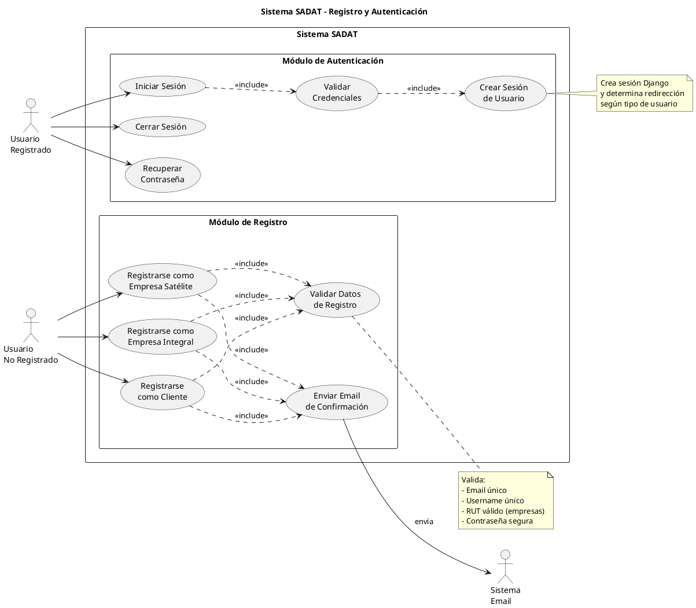
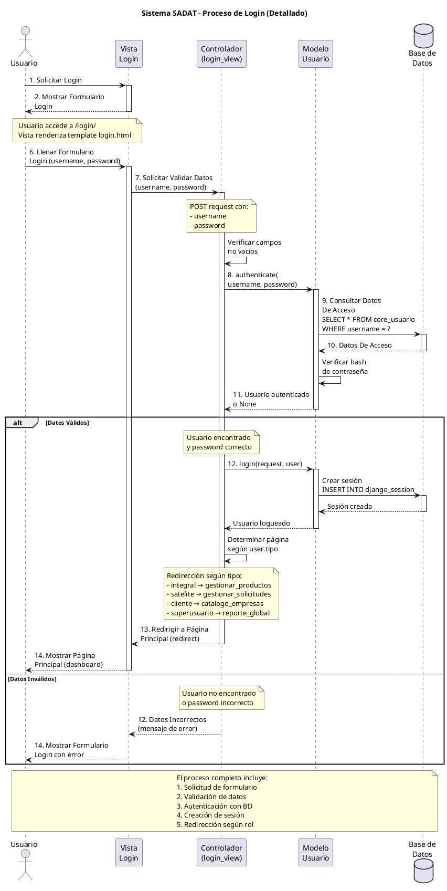
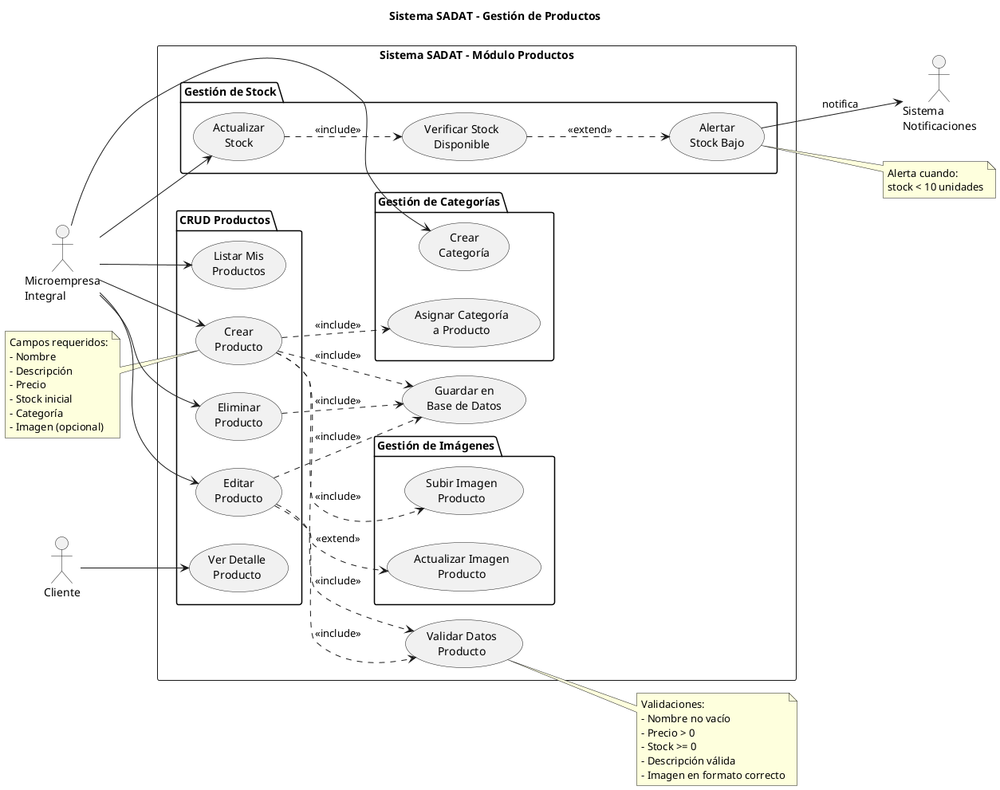
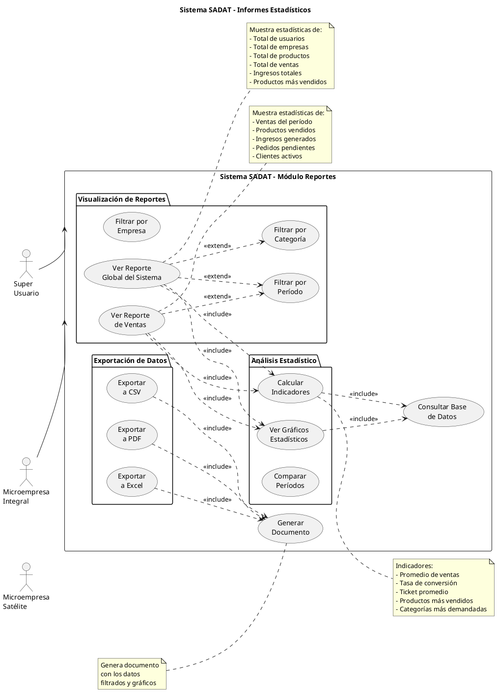
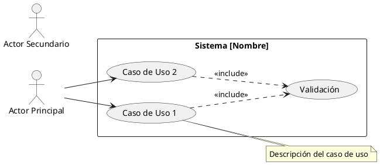
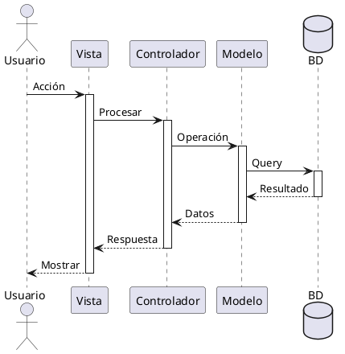

# Ejemplos Prácticos Detallados - Creación de Diagramas UML

## 📌 Basado en Proyecto de Referencia (.vpd files)

Este documento muestra **ejemplos completos paso a paso** de cómo crear cada tipo de diagrama UML, siguiendo la metodología del proyecto de referencia.

---

## 🎯 EJEMPLO 1: Diagrama de Casos de Uso - Registro y Login

### Análisis del Archivo de Referencia: "Caso de uso registro y login.vpd"

#### Paso 1: Identificar Actores

```
Actor Principal: Usuario No Registrado
Actor Secundario: Usuario Registrado
Actor del Sistema: Sistema de Email
```

#### Paso 2: Identificar Casos de Uso

**Funcionalidades de Registro:**
- UC01: Registrarse como Cliente
- UC02: Registrarse como Empresa Integral
- UC03: Registrarse como Empresa Satélite
- UC04: Validar Datos de Registro
- UC05: Enviar Email de Confirmación

**Funcionalidades de Login:**
- UC06: Iniciar Sesión
- UC07: Validar Credenciales
- UC08: Crear Sesión
- UC09: Cerrar Sesión
- UC10: Recuperar Contraseña

#### Paso 3: Definir Relaciones

```
Usuario No Registrado --> UC01 (Asociación)
Usuario No Registrado --> UC02 (Asociación)
Usuario No Registrado --> UC03 (Asociación)

UC01 ..> UC04 <<include>> (Todos requieren validación)
UC02 ..> UC04 <<include>>
UC03 ..> UC04 <<include>>

UC01 ..> UC05 <<include>> (Enviar confirmación)
UC02 ..> UC05 <<include>>
UC03 ..> UC05 <<include>>

Usuario Registrado --> UC06 (Asociación)
UC06 ..> UC07 <<include>> (Login requiere validación)
UC07 ..> UC08 <<include>> (Validación crea sesión)

Usuario Registrado --> UC09 (Asociación)
Usuario Registrado --> UC10 (Asociación)
```

#### Paso 4: Código PlantUML Completo



---

## 🔄 EJEMPLO 2: Diagrama de Secuencia - Proceso de Login

### Análisis del Archivo de Referencia: "Caso de uso login.vpd"

Este es el diagrama que coincide con la imagen de referencia proporcionada.

#### Paso 1: Listar Participantes (en orden de aparición)

```
1. Usuario (Actor)
2. Vista Login (Boundary)
3. Controlador login_view (Control)
4. Modelo Usuario (Entity)
5. Base de Datos (Database)
```

#### Paso 2: Definir Flujo Principal

**Secuencia de Mensajes:**

```
1.  Usuario → Vista: Solicitar Login
2.  Vista → Usuario: Mostrar Formulario Login
3.  Usuario → Vista: Llenar Formulario (username, password)
4.  Vista → Controlador: Solicitar Validar Datos
5.  Controlador → Controlador: Verificar campos no vacíos
6.  Controlador → Modelo: authenticate(username, password)
7.  Modelo → Base de Datos: Consultar Datos De Acceso
8.  Base de Datos → Modelo: Datos De Acceso
9.  Modelo → Modelo: Verificar hash de contraseña
10. Modelo → Controlador: Usuario autenticado o None
```

#### Paso 3: Definir Flujos Alternativos

**Alt: Datos Válidos**
```
11. Controlador → Modelo: login(request, user)
12. Modelo → Base de Datos: Crear sesión
13. Base de Datos → Modelo: Sesión creada
14. Modelo → Controlador: Usuario logueado
15. Controlador → Controlador: Determinar página según rol
16. Controlador → Vista: Redirigir a Página Principal
17. Vista → Usuario: Mostrar Página Principal
```

**Alt: Datos Inválidos**
```
11. Controlador → Vista: Datos Incorrectos (mensaje error)
12. Vista → Usuario: Mostrar Formulario Login con error
```

#### Paso 4: Código PlantUML Completo



---

## 📊 EJEMPLO 3: Diagrama de Casos de Uso - Gestión de Productos

### Análisis del Archivo de Referencia: "Caso de uso Gestio de productos.vpd"

#### Paso 1: Identificar Actores

```
Actor Principal: Microempresa Integral
Actor Secundario: Cliente (para visualización)
Actor del Sistema: Sistema de Notificaciones
```

#### Paso 2: Identificar Casos de Uso

**CRUD de Productos:**
- UC01: Crear Producto
- UC02: Editar Producto
- UC03: Eliminar Producto
- UC04: Listar Productos
- UC05: Ver Detalle Producto

**Gestión de Stock:**
- UC06: Actualizar Stock
- UC07: Verificar Stock Disponible
- UC08: Alertar Stock Bajo

**Gestión de Categorías:**
- UC09: Crear Categoría
- UC10: Asignar Categoría a Producto

**Gestión de Imágenes:**
- UC11: Subir Imagen Producto
- UC12: Actualizar Imagen Producto

#### Paso 3: Código PlantUML Completo



---

## 📈 EJEMPLO 4: Diagrama de Casos de Uso - Informe Estadístico General

### Análisis del Archivo de Referencia: "Caso de uso Informe estadistico general.vpd"

#### Paso 1: Identificar Actores

```
Actor Principal: Super Usuario
Actor Secundario: Microempresa Integral
Actor Secundario: Microempresa Satélite
```

#### Paso 2: Identificar Casos de Uso

**Visualización de Reportes:**
- UC01: Ver Reporte Global del Sistema
- UC02: Ver Reporte de Ventas (Empresas)
- UC03: Filtrar por Período
- UC04: Filtrar por Categoría
- UC05: Filtrar por Empresa

**Exportación:**
- UC06: Exportar a PDF
- UC07: Exportar a Excel
- UC08: Exportar a CSV

**Análisis:**
- UC09: Ver Gráficos Estadísticos
- UC10: Calcular Indicadores
- UC11: Comparar Períodos

#### Paso 3: Código PlantUML Completo



---

## 🎓 LECCIONES APRENDIDAS DEL PROYECTO DE REFERENCIA

### 1. Organización de Diagramas

**Del proyecto .vpd aprendemos:**
- Separar diagramas por módulo funcional
- Un archivo por proceso principal
- Nomenclatura descriptiva de archivos

### 2. Nivel de Detalle

**Casos de Uso:**
- No incluir detalles técnicos
- Enfocarse en la funcionalidad del usuario
- Usar lenguaje del dominio del negocio

**Diagramas de Secuencia:**
- Incluir todos los pasos importantes
- Numerar mensajes secuencialmente
- Mostrar alternativas con "alt"

### 3. Uso de Relaciones

**Include vs Extend:**
- **Include**: Funcionalidad siempre requerida
  - Ejemplo: Login → Validar Credenciales
- **Extend**: Funcionalidad opcional
  - Ejemplo: Ver Producto → Agregar Comentario

### 4. Notas Explicativas

**Siempre incluir notas para:**
- Validaciones de datos
- Reglas de negocio importantes
- Decisiones de diseño
- Restricciones del sistema

---

## 📋 PLANTILLAS REUTILIZABLES

### Plantilla: Caso de Uso Básico



### Plantilla: Secuencia Básica



---

**Última actualización**: Octubre 2025  
**Basado en**: Proyecto de Referencia Visual Paradigm (.vpd files)
