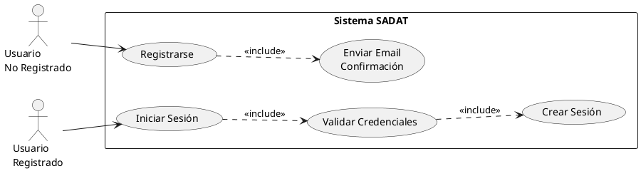
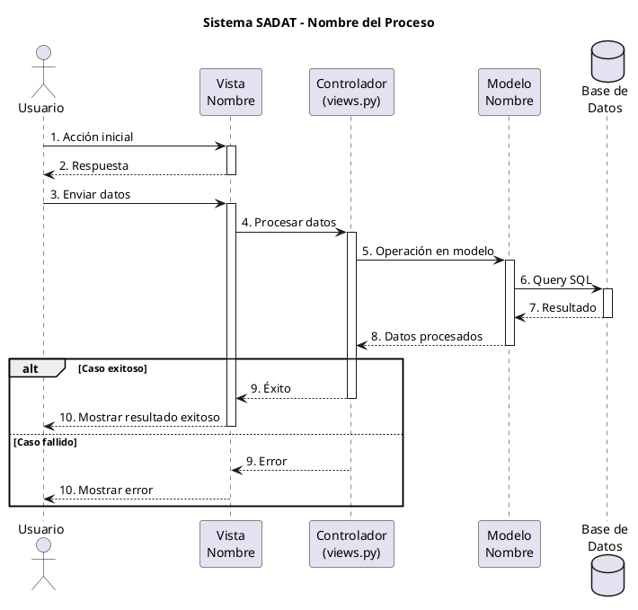
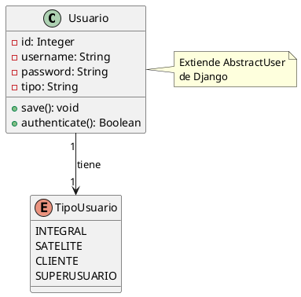
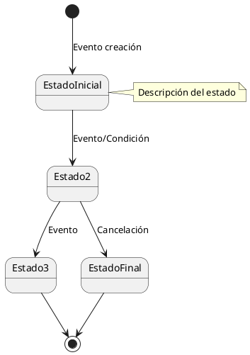

# Metodología de Creación de Diagramas UML - Sistema SADAT

## 📋 Introducción

Este documento detalla **paso a paso** cómo se crearon los diagramas UML del Sistema SADAT, basándose en la metodología utilizada en proyectos similares que usaron Visual Paradigm (.vpd).

---

## 🎯 FASE 1: Análisis y Planificación

### Paso 1.1: Identificar los Actores del Sistema

Los actores son los usuarios o sistemas externos que interactúan con nuestro sistema:

**Actores Principales:**
- 👤 **Cliente** - Usuario final que compra productos
- 🏭 **Microempresa Integral** - Produce y vende productos terminados
- 🏭 **Microempresa Satélite** - Ofrece servicios de confección
- 👑 **Super Usuario** - Administrador del sistema
- 🤖 **Sistema** - Para procesos automáticos (emails, notificaciones)

### Paso 1.2: Identificar Módulos Funcionales

Dividir el sistema en módulos lógicos:

1. **Módulo Core** - Autenticación y usuarios
2. **Módulo Empresas** - Gestión de microempresas y productos
3. **Módulo Pedidos** - Carrito y gestión de pedidos
4. **Módulo Pagos** - Procesamiento con Stripe
5. **Módulo Reportes** - Estadísticas y exportación
6. **Módulo Notificaciones** - Alertas del sistema

### Paso 1.3: Listar Casos de Uso por Módulo y Actor

**Formato:** [Actor] → [Caso de Uso] → [Descripción]

#### Módulo Core (Autenticación)
- Cliente → Registrarse → Crear cuenta nueva
- Cliente → Iniciar Sesión → Autenticarse en el sistema
- Cliente → Cerrar Sesión → Terminar sesión activa
- Cliente → Recuperar Contraseña → Restablecer password olvidado
- Todos → Ver/Editar Perfil → Gestionar datos personales

#### Módulo Empresas
- Empresa Integral → Gestionar Productos → CRUD de productos
- Empresa Integral → Gestionar Categorías → CRUD de categorías
- Empresa Satélite → Gestionar Servicios → CRUD de servicios
- Empresa Satélite → Gestionar Maquinaria → CRUD de máquinas
- Cliente → Ver Catálogo → Navegar productos disponibles

#### Módulo Pedidos
- Cliente → Agregar al Carrito → Añadir productos
- Cliente → Realizar Pedido → Confirmar compra
- Cliente → Solicitar Pedido Personalizado → Pedir cotización
- Empresa Integral → Gestionar Pedidos → Ver/actualizar pedidos
- Empresa Satélite → Gestionar Solicitudes → Ver/cotizar solicitudes

#### Módulo Pagos
- Cliente → Realizar Pago → Pagar con Stripe
- Cliente → Ver Historial de Pagos → Revisar transacciones

#### Módulo Reportes
- Super Usuario → Ver Reporte Global → Estadísticas generales
- Empresas → Ver Reportes de Ventas → Estadísticas propias
- Todos → Exportar Reportes → Descargar en PDF/Excel

---

## 🎨 FASE 2: Creación de Diagramas de Casos de Uso

### Paso 2.1: Estructura del Diagrama

```
┌─────────────────────────────────────────┐
│  Sistema SADAT - Casos de Uso           │
├─────────────────────────────────────────┤
│                                          │
│  Actor 1 ─────○ (Caso de Uso 1)        │
│                                          │
│  Actor 2 ─────○ (Caso de Uso 2)        │
│                 │                        │
│                 └──▶ (Caso de Uso 3)    │
│                       <<include>>        │
└─────────────────────────────────────────┘
```

### Paso 2.2: Elementos del Diagrama

**A) Actores (Stick Figures)**
- Representar con íconos de persona
- Nombre debajo del ícono
- Posicionar a la izquierda del diagrama

**B) Casos de Uso (Óvalos)**
- Verbo + Sustantivo (ej: "Gestionar Productos")
- Dentro de un rectángulo que representa el sistema
- Organizados por módulos

**C) Relaciones**
- **Asociación** (línea simple): Actor usa el caso de uso
- **Include** (flecha punteada): Un caso de uso incluye otro obligatoriamente
- **Extend** (flecha punteada): Un caso de uso extiende otro opcionalmente
- **Generalización** (flecha triangular): Herencia entre actores o casos de uso

### Paso 2.3: Ejemplo Práctico - Login y Registro



---

## 🔄 FASE 3: Creación de Diagramas de Secuencia

### Paso 3.1: Identificar Participantes (Lifelines)

Para cada proceso importante, identificar los objetos que participan:

**Patrón MVC (Modelo-Vista-Controlador):**
1. **Actor**: Usuario (Cliente, Empresa, etc.)
2. **Vista**: Interfaz HTML/Templates
3. **Controlador**: Views de Django
4. **Modelo**: Models de Django
5. **Base de Datos**: PostgreSQL/SQLite
6. **Servicios Externos**: Stripe, Email, etc.

### Paso 3.2: Definir el Flujo de Mensajes

**Estructura de numeración:**
```
1. Usuario → Vista
2. Vista → Controlador
3. Controlador → Modelo
4. Modelo → Base de Datos
5. Base de Datos → Modelo
6. Modelo → Controlador
7. Controlador → Vista
8. Vista → Usuario
```

### Paso 3.3: Ejemplo Detallado - Proceso de Login

**Participantes:**
- Usuario
- Vista Login
- Controlador (login_view)
- Modelo Usuario
- Base de Datos

**Mensajes:**

1. **Usuario → Vista**: Solicitar formulario de login
2. **Vista → Usuario**: Mostrar formulario
3. **Usuario → Vista**: Enviar credenciales (username, password)
4. **Vista → Controlador**: POST con datos
5. **Controlador → Controlador**: Validar datos no vacíos
6. **Controlador → Modelo**: authenticate(username, password)
7. **Modelo → BD**: SELECT * FROM usuarios WHERE username=?
8. **BD → Modelo**: Datos del usuario
9. **Modelo → Modelo**: Verificar password hash
10. **Modelo → Controlador**: Usuario autenticado o None

**Alternativas (alt):**

```
alt [Credenciales válidas]
  11. Controlador → Modelo: login(request, user)
  12. Modelo → BD: Crear sesión
  13. BD → Modelo: Sesión creada
  14. Modelo → Controlador: Usuario logueado
  15. Controlador → Controlador: Determinar página según rol
  16. Controlador → Vista: Redirigir a página principal
  17. Vista → Usuario: Mostrar dashboard
else [Credenciales inválidas]
  11. Controlador → Vista: Mensaje de error
  12. Vista → Usuario: Mostrar formulario con error
end
```

### Paso 3.4: Plantilla PlantUML para Secuencia



---

## 📊 FASE 4: Creación de Diagramas de Clases

### Paso 4.1: Identificar las Clases del Sistema

**Fuentes:**
- Models de Django (models.py)
- Clases auxiliares (services, utilities)
- Enumeraciones (choices)

### Paso 4.2: Estructura de una Clase

```plantuml
class NombreClase {
  - atributo_privado: Tipo
  # atributo_protegido: Tipo
  + atributo_publico: Tipo
  __
  + metodo_publico(): TipoRetorno
  - metodo_privado(): TipoRetorno
}
```

**Visibilidad:**
- `+` público
- `-` privado
- `#` protegido
- `~` package

### Paso 4.3: Tipos de Relaciones

**A) Asociación (línea simple)**
```
ClaseA --> ClaseB : descripcion
ClaseA "1" --> "*" ClaseB : tiene muchos
```

**B) Agregación (diamante vacío)**
```
ClaseA o-- ClaseB
```

**C) Composición (diamante lleno)**
```
ClaseA *-- ClaseB
```

**D) Herencia (flecha triangular)**
```
ClasePadre <|-- ClaseHija
```

**E) Dependencia (flecha punteada)**
```
ClaseA ..> ClaseB : usa
```

### Paso 4.4: Ejemplo - Módulo Core



---

## 🔁 FASE 5: Creación de Diagramas de Estados

### Paso 5.1: Identificar Estados Posibles

Para entidades con ciclo de vida (Pedido, Transacción, etc.):

**Ejemplo - Pedido:**
- Estado Inicial: Pendiente
- Estados Intermedios: En Producción, Terminado, Enviado
- Estados Finales: Entregado, Cancelado

### Paso 5.2: Definir Transiciones

Cada transición tiene:
- **Estado origen**
- **Evento disparador**
- **Condición** (opcional)
- **Acción** (opcional)
- **Estado destino**

### Paso 5.3: Plantilla de Diagrama de Estados



---

## 🏗️ FASE 6: Diagramas de Arquitectura

### Paso 6.1: Diagrama de Componentes

**Elementos:**
- **Componentes**: Módulos funcionales [Componente]
- **Interfaces**: Puntos de conexión ()
- **Paquetes**: Agrupaciones package { }
- **Dependencias**: Flechas -->

### Paso 6.2: Diagrama de Despliegue

**Elementos:**
- **Nodos**: Servidores físicos/virtuales node { }
- **Componentes**: Software deployado
- **Conexiones**: Protocolos de comunicación
- **Artefactos**: Archivos, DBs artifact

---

## ✅ CHECKLIST DE VALIDACIÓN

### Para Cada Diagrama Creado:

- [ ] Tiene título descriptivo
- [ ] Todos los elementos están etiquetados
- [ ] Las relaciones están claramente definidas
- [ ] Hay notas explicativas donde sea necesario
- [ ] La numeración de mensajes es secuencial (para secuencia)
- [ ] Los estados iniciales/finales están marcados (para estados)
- [ ] El diagrama es legible y no está sobrecargado
- [ ] Sigue las convenciones UML estándar
- [ ] Está documentado en el README

---

## 🛠️ HERRAMIENTAS RECOMENDADAS

### Opción 1: PlantUML (Actual)
- **Pros**: Texto plano, versionable, gratis
- **Cons**: Menos control visual
- **Uso**: Integrado en VS Code

### Opción 2: Visual Paradigm
- **Pros**: Interfaz gráfica, muy completo
- **Cons**: Propietario, formato .vpd
- **Uso**: Drag & drop

### Opción 3: Draw.io / diagrams.net
- **Pros**: Gratis, web-based
- **Cons**: Formato XML
- **Uso**: Visual, exporta a varios formatos

---

## 📚 REFERENCIAS Y RECURSOS

### Documentación UML:
- UML 2.5 Specification
- PlantUML Language Reference Guide
- Martin Fowler - UML Distilled

### Patrones Aplicados:
- MVC (Model-View-Controller)
- Repository Pattern
- Service Layer Pattern

---

## 📝 NOTAS IMPORTANTES

### Convenciones de Nombres:
- **Casos de Uso**: Verbo + Sustantivo (ej: "Gestionar Productos")
- **Clases**: Sustantivo en singular (ej: "Usuario", "Producto")
- **Métodos**: verbo en infinitivo (ej: "guardar", "eliminar")
- **Atributos**: sustantivo_descriptivo (ej: "nombre_empresa")

### Mejores Prácticas:
1. **Un diagrama, un propósito**: No mezclar diferentes aspectos
2. **Nivel de detalle apropiado**: Ni muy abstracto ni muy detallado
3. **Consistencia**: Usar los mismos nombres en todos los diagramas
4. **Actualización**: Mantener sincronizado con el código
5. **Documentación**: Explicar decisiones de diseño en notas

---

**Última actualización**: Octubre 2025  
**Sistema**: SADAT - Sistema de Apoyo al Desarrollo de Artesanos Textiles
